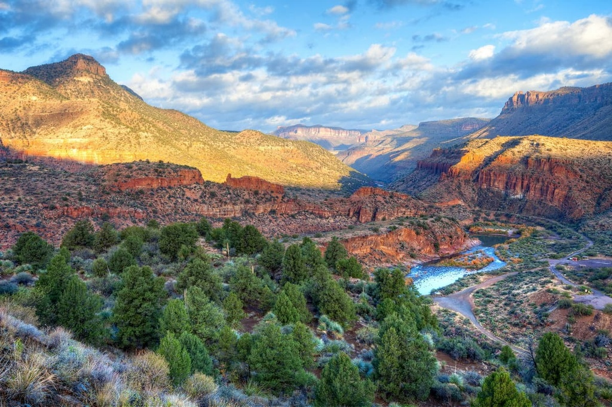

# Biodiversity Intactness Index (BII) of Phoenix, Arizona from 2017-2020

## About: 




- Combine `geopandas` geodataframe with `xarray` raster data to visualize biodiversity loss
- Practice using STAC collection search and wrangling `xarray` dataframe
- Visualize the surroundings of Phoenix to provide geographic context
- Filter raster to calculate percent 75% loss of biodiversity

## Repository Structure

```bash
biodiversity-intactness
│
├── data                        
│   ├──tl_2020_04_cousub.cpg
│   ├──tl_2020_04_cousub.dbf
│   ├──tl_2020_04_cousub.prj 
│   ├──tl_2020_04_cousub.shp  # Shapefile for mapping Thomas file
│   ├──tl_2020_04_cousub.shp.ea.iso.xml
│   ├──tl_2020_04_cousub.shp.iso.xml
│   ├──tl_2020_04_cousub.shx   
│
├── bii.ipynb # Jupyter notebook for analysis      
├── README.md  
├── LICENSE                      
├── .gitignore  
│
├── images/                       
│   ├── Tonto-National-Forest-Arizona.jpg  # Image used in the README
│                
```

## Data

All of the data is located in the data folder. This landsat data was retrieved from the [Microsoft Planetary Computer STAC Catalog](https://planetarycomputer.microsoft.com/dataset/io-biodiversity).  

The Phoenix shapefiles  data can be directly accessed by using this [link](https://www.census.gov/cgi-bin/geo/shapefiles/index.php?year=2020&layergroup=County+Subdivisions) and selecting Arizona when prompted for County Subdivision.

## References

Galaz García, Carmen. Assignment4 – EDS 220 - Working with Environmental Datasets. (n.d.). https://meds-eds-220.github.io/MEDS-eds-220-course/assignments/final-project.html

Microsoft Planetary Computer. (n.d.). https://planetarycomputer.microsoft.com/dataset/landsat-c2-l2

Publisher CAL FIRE. (2024, May 14). State of California - California Fire Perimeters (all). Catalog. https://catalog.data.gov/dataset/california-fire-perimeters-all-b3436 

